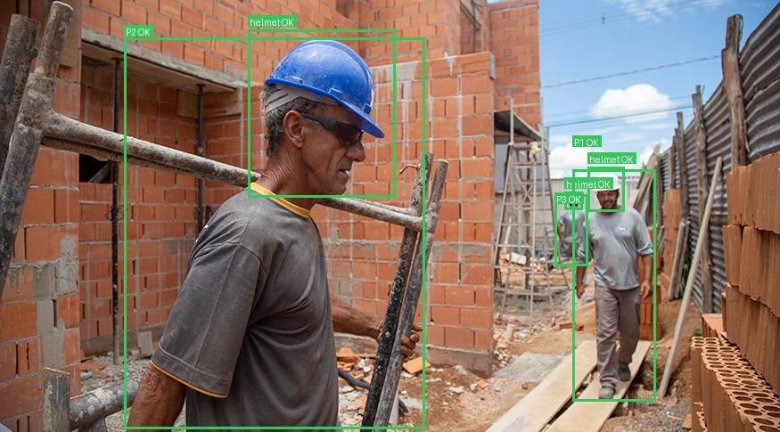
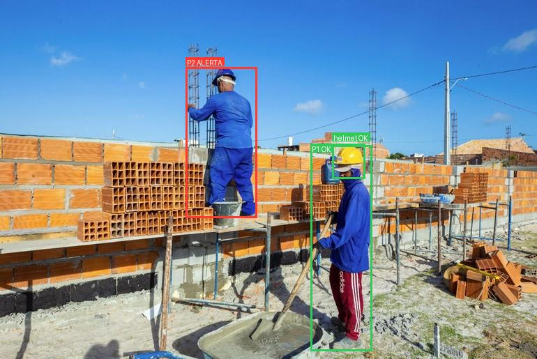
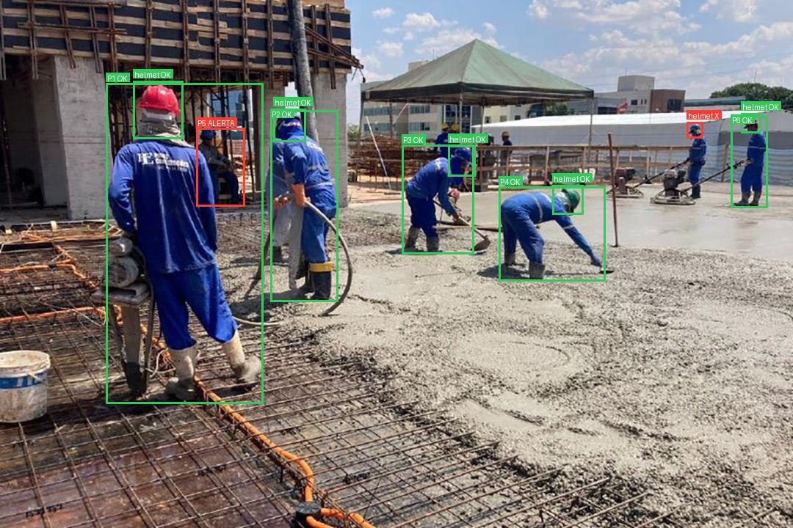

# Detecção e validação de capacetes com RF-DETR

Projeto de visão computacional para canteiros de obras. Ele treina um `RFDETRSmall`
para detectar capacetes e o combina com `RFDETRKeypointPreview` para validar o uso
do capacete por pessoa.

**Código e receitas:** este repositório no
[GitHub](https://github.com/matheeusper/epi-with-keypoints) · **Checkpoint treinado
e model card:** [Hugging Face Hub](https://huggingface.co/matheeusper/epi-with-keypoints)

O GitHub não armazena pesos, datasets ou vídeos completos. O Hugging Face não
duplica o código da aplicação: ele mantém somente a release reproduzível do
modelo.

## Funcionamento

```text
Imagem
├── RFDETRSmall treinado ───────────────► capacetes
└── RFDETRKeypointPreview pré-treinado ─► pessoas e keypoints
                                             │
                                             ▼
                       associação + validação da região da cabeça
                                             │
                                             ▼
                       imagem anotada + relatório JSON
```

Em vídeos, as caixas de pessoa passam também pelo ByteTrack antes da associação.
O tracker mantém um ID estável para cada pessoa e reaproveita o estado durante
oclusões curtas; imagens continuam sendo avaliadas de forma independente.

O checkpoint deste projeto possui uma única classe positiva, `helmet`. As pessoas
são obtidas exclusivamente pelo modelo pré-treinado de keypoints.

### Por que combinar um modelo treinado com keypoints pré-treinados?

O `RFDETRSmall` é treinado especificamente com as imagens e anotações de EPI do
projeto. Por isso, ele aprende a localizar capacetes no cenário real de canteiro,
com iluminação, distância, ângulos e tipos de equipamento presentes no dataset.
Por outro lado, ele não oferece contexto corporal suficiente para responder a
pergunta mais importante: **aquele capacete pertence a qual pessoa?**

O `RFDETRKeypointPreview` já vem pré-treinado para localizar pessoas e os pontos
da cabeça, como nariz, olhos e orelhas. Usá-lo evita a necessidade de anotar
keypoints manualmente no dataset de EPI e permite validar se o capacete detectado
está na região esperada da pessoa.

Essa combinação traz três vantagens principais:

- **Menos falsos positivos:** um objeto parecido com capacete, mas longe de uma
  cabeça, pode ser marcado como inválido.
- **Resultado por pessoa:** em vez de apenas contar capacetes na imagem, a
  pipeline informa quais pessoas estão protegidas ou em alerta.
- **Melhor aproveitamento do dataset:** o detector é especializado no EPI local,
  enquanto o conhecimento corporal vem de um modelo de pose já treinado em grande
  escala.

## Recursos

- Treinamento configurável por YAML.
- Receitas para treino padrão, rápido, com aumentos agressivos e learning rate menor.
- Inferência combinada de capacete e pose humana.
- Associação automática do capacete à pessoa mais próxima.
- Tracking de pessoas com IDs persistentes em vídeos.
- Estabilização temporal dos alertas de ausência de capacete.
- Validação geométrica pela região da cabeça.
- Alertas minimalistas e relatório JSON por pessoa.

## Instalação

Requisitos: Python 3.10+, [uv](https://docs.astral.sh/uv/) e, preferencialmente, GPU CUDA.

```bash
git clone git@github.com:matheeusper/epi-with-keypoints.git
cd epi-with-keypoints
uv sync
```

Os comandos usam `uv run`, portanto não é preciso ativar o ambiente virtual manualmente.

## Dataset

O dataset de origem é o
[51ddhesh/PPE_Detection](https://huggingface.co/datasets/51ddhesh/PPE_Detection),
disponibilizado sob licença CC BY 4.0. A cópia usada neste projeto contém 12.078
imagens: 8.774 de treino, 2.070 de validação e 1.234 de teste. As seis classes são
`Gloves`, `Vest`, `goggles`, `helmet`, `mask` e `safety_shoe`.

O treinamento lê as classes diretamente do `data.yaml`. A opção `--classes`
aceita nomes, IDs ou `all`, sem criar ou modificar arquivos do dataset. A seleção
e a reindexação acontecem somente em memória, dentro do carregador de dados.

O dataset deve usar o layout YOLO aceito pelo RF-DETR:

```text
datasets/PPE_Detection/
├── data.yaml
├── train/
│   ├── images/
│   └── labels/
├── valid/
│   ├── images/
│   └── labels/
└── test/
    ├── images/
    └── labels/
```

Baixe e descompacte o arquivo do Hub uma única vez:

```bash
mkdir -p datasets
uv run hf download 51ddhesh/PPE_Detection PPE.zip \
  --repo-type dataset --local-dir datasets
unzip datasets/PPE.zip -d datasets
mv datasets/PPE datasets/PPE_Detection
```

Se escolher outro caminho, altere `general.dataset_dir` no YAML. O RF-DETR lê
diretamente caixas e polígonos YOLO; no treino de detecção, usa a caixa envolvente
de cada polígono.

## Treinamento

O [train.py](train.py) carrega a receita, fixa a seed, instancia `RFDETRSmall` e inicia o treinamento.

Escolha as classes diretamente no comando:

```bash
# somente capacete
uv run python train.py --config configs/helmet_576.yaml --classes helmet

# capacete e colete
uv run python train.py --config configs/helmet_576.yaml --classes helmet Vest

# todas as classes (também é o comportamento padrão)
uv run python train.py --config configs/base.yaml --classes all
```

Também é possível usar os IDs originais, por exemplo `--classes 3 1`. A ordem
informada define os novos IDs: nesse exemplo, a classe original `3` vira `0` e a
classe original `1` vira `1` durante o treinamento.

Ao escolher classes específicas, o treino mantém todas as imagens que possuem ao
menos uma anotação selecionada e, por padrão, no máximo uma imagem negativa para
cada positiva. A seleção é reproduzível pela `seed` da configuração:

```bash
# duas imagens negativas para cada positiva
uv run python train.py --config configs/helmet_576.yaml \
  --classes helmet --negative-ratio 2

# somente imagens positivas
uv run python train.py --config configs/helmet_576.yaml \
  --classes helmet --negative-ratio 0

# manter todas as imagens negativas
uv run python train.py --config configs/helmet_576.yaml \
  --classes helmet --negative-ratio -1
```

A limitação é aplicada somente ao split de treino. Validação e teste mantêm todas
as imagens para que as métricas representem o dataset completo. Com `--classes
all`, todas as imagens também são mantidas.

Para reproduzir o treinamento do checkpoint de capacete, mantenha a seleção
explícita no comando:

```bash
uv run python train.py --config configs/helmet_576.yaml --classes helmet
```

| Receita | Uso |
| --- | --- |
| `configs/base.yaml` | Receita base para treinamento multiclasse. |
| `configs/fast.yaml` | Teste rápido para o dataset multiclasse. |
| `configs/high_augmentation.yaml` | Aumentos fortes para o dataset multiclasse. |
| `configs/low_learning_rate.yaml` | Ajuste fino multiclasse com learning rate menor. |
| `configs/smoke_576.yaml` | Teste de VRAM e pipeline em 576 px. |
| `configs/helmet_576.yaml` | Receita recomendada para treinar `helmet`. |

As receitas contêm `general`, `training`, `early_stopping` e `augmentations`. Ajuste `dataset_dir`, `device`, `epochs`, `batch_size` e `lr` conforme seu ambiente.
Elas usam `device: cuda`; sem GPU CUDA, altere esse campo para `cpu` (o treino será
consideravelmente mais lento).

O treino recomendado grava o melhor modelo regular em
`output_helmet_only_576/checkpoint_best_regular.pth`. Pesos não são versionados no
GitHub. O checkpoint publicado está disponível em
[matheeusper/epi-with-keypoints](https://huggingface.co/matheeusper/epi-with-keypoints)
no Hugging Face Hub. Se `models/helmet_only_576_best.pth` não existir, os comandos
de inferência e avaliação baixam esse arquivo automaticamente. Também é possível
informar um checkpoint local com `--ppe-checkpoint` ou outro repositório com
`--hf-repo-id`.

## Métricas do treinamento

O checkpoint avaliado foi treinado para a única classe `helmet`, em resolução de
576 px. A avaliação usa diretamente o split de teste completo do dataset original,
incluindo imagens sem capacete.

| Indicador do checkpoint | Valor |
| --- | --- |
| Épocas concluídas no checkpoint | 20 (época 19, iniciando em zero) |
| Passos globais | 2.000 |

### Avaliação no conjunto de teste

O checkpoint foi avaliado em 1.234 imagens e 597 capacetes anotados do split `test`.
As métricas abaixo usam a avaliação COCO de caixas; precisão, recall e F1 usam
IoU de 0,50 no melhor limiar de confiança.

| Métrica | Resultado |
| --- | ---: |
| mAP@[0.50:0.95] | 58,90% |
| mAP@0.50 | 89,62% |
| mAP@0.75 | 67,41% |
| mAR@100 | 74,09% |
| Precisão@0.50 | 86,68% |
| Recall@0.50 | 90,45% |
| F1@0.50 | 88,52% |
| Confiança no melhor F1 | 0,570 |

Para reproduzir a avaliação, execute:

```bash
uv run python evaluate_helmet.py \
  --checkpoint output_helmet_only_576/checkpoint_best_regular.pth \
  --class helmet
```

O relatório completo é salvo em `outputs/evaluation/helmet_test_regular.json`.
O avaliador lê diretamente `datasets/PPE_Detection/test` e seleciona `helmet`
pelo `data.yaml`, sem modificar o dataset.

## Inferência e validação de capacete

O [infer_ppe_keypoints.py](infer_ppe_keypoints.py) carrega o checkpoint treinado, o modelo de keypoints e a imagem. Na primeira execução, os pesos de keypoints podem ser baixados automaticamente.

```bash
uv run python infer_ppe_keypoints.py \
  --image images/image2.jpg \
  --ppe-checkpoint output_helmet_only_576/checkpoint_best_regular.pth
```

Sem `--ppe-checkpoint`, o modelo é usado de `models/` ou baixado automaticamente
do Hugging Face Hub na primeira execução:

```bash
uv run python infer_ppe_keypoints.py --image images/image2.jpg
```

Também é possível processar um vídeo completo. Os modelos são carregados uma única
vez e aplicados a cada quadro; a saída preserva a taxa de quadros do arquivo de
entrada. Por padrão, identidades oclusas são conservadas por até 1 segundo e uma
ausência só vira alerta quando ocupa a maioria estrita de uma janela de 1 segundo.
Detecções de pessoa abaixo do limiar principal podem prolongar um track existente,
mas não são desenhadas nem contam como ausência de capacete.

### Validação por sobreposição, track e tempo

Em vídeo, a decisão não é tomada apenas olhando um quadro isolado. A pipeline
combina validação espacial, identidade persistente e histórico temporal:

```text
Detecções do quadro
        │
        ▼
remove pessoas duplicadas por sobreposição (IoU)
        │
        ▼
ByteTrack mantém um track_id para cada pessoa
        │
        ▼
capacete é associado à cabeça mais compatível
        │
        ▼
estado instantâneo entra no histórico daquele track_id
        │
        ▼
regra temporal produz OK, inconclusivo ou ALERTA
```

**Sobreposição espacial.** Primeiro, caixas de pessoa quase idênticas são
suprimidas usando IoU; por padrão, duas caixas com IoU a partir de `0.75` não são
mantidas como pessoas diferentes. Quando pessoas reais aparecem muito próximas e
suas caixas corporais se sobrepõem, o capacete não é atribuído somente pela caixa
do corpo: o algoritmo compara o centro do capacete com os keypoints de cabeça de
cada pessoa e escolhe a cabeça mais compatível. A caixa corporal é usada apenas
quando não existem keypoints confiáveis da cabeça.

**Validação por track.** O ByteTrack entrega um `track_id` persistente para cada
pessoa. Cada ID possui seu próprio histórico de capacete; portanto, observações de
duas pessoas próximas não são misturadas. Detecções fracas podem atualizar o
movimento de um track existente, mas não são exibidas e não geram voto de
ausência.

**Validação temporal.** Para cada `track_id`, o estado instantâneo de cada quadro
é guardado em uma janela de 1 segundo por padrão. Um capacete validado recupera o
estado `OK` imediatamente e limpa votos antigos de ausência. Uma ausência ou um
capacete fora da região só produz `ALERTA` quando ocupa mais da metade da janela.
Quando a cabeça não pode ser verificada, o quadro é inconclusivo e não conta como
ausência.

**Sobreposição ou oclusão temporária.** Se uma pessoa passar atrás de outra ou
ficar escondida por alguns quadros, o tracker conserva seu ID e o último estado
confiável por até 1 segundo. Durante esse intervalo, a pipeline não inventa uma
caixa nem transforma automaticamente a oclusão em ausência de capacete. Se a
pessoa reaparecer dentro do buffer, o mesmo histórico continua; depois que o
buffer expira, o estado antigo é descartado e um novo track começa como
`nao_verificavel`.

Imagens estáticas não usam tracking nem histórico temporal: nelas, a associação e
a validação geométrica são calculadas uma única vez.

```bash
uv run python infer_ppe_keypoints.py --video videos/obra.mp4
```

O comando acima cria `outputs/obra/annotated/obra_ppe_keypoints.mp4` e
`outputs/obra/reports/obra_ppe_keypoints.json`. O JSON inclui o resultado de cada
quadro e o respectivo instante em segundos. Para escolher os destinos e testar
apenas parte do vídeo:

```bash
uv run python infer_ppe_keypoints.py \
  --video videos/obra.mp4 \
  --output resultados/obra_anotada.mp4 \
  --report resultados/obra_relatorio.json \
  --max-frames 100
```

Se o codec padrão `mp4v` não estiver disponível, informe um codec aceito pelo
sistema, por exemplo `--codec avc1`.

Os limiares padrão foram calibrados como ponto de partida para esse modelo:
`0.35` para capacetes, `0.55` para pessoas, `0.30` para keypoints e `0.75` para
supressão de pessoas duplicadas. Ajuste-os com vídeos reais do ambiente quando
for necessário priorizar mais detecções ou menos falsos alertas.

Por padrão, cada inferência é organizada em uma pasta própria dentro de `outputs/`:

```text
outputs/
└── image/
    ├── annotated/
    │   └── image_ppe_keypoints.jpg   # imagem ou vídeo anotado
    └── reports/
        └── image_ppe_keypoints.json  # relatório de conformidade
```

### Anotações

- `P1 OK` verde: pessoa com capacete validado na região da cabeça.
- `P1 ?` laranja: track novo ou estado ainda inconclusivo.
- `P1 ALERTA` vermelho: pessoa sem capacete validado.
- `helmet OK` verde: capacete em posição compatível.
- `helmet X` vermelho: capacete fora da região esperada ou sem associação.

Em vídeos, o número após `P` é o ID persistente do tracker, e não a posição da
pessoa na lista de detecções daquele quadro. Pessoas completamente invisíveis não
recebem caixas congeladas; o ID e o último estado continuam guardados apenas para
uma possível reassociação dentro do buffer configurado.

Os keypoints são usados internamente e ficam ocultos por padrão para manter a imagem limpa.

### Resultados nas imagens de exemplo

As cinco imagens abaixo foram processadas com
`output_helmet_only_576/checkpoint_best_regular.pth`, usando os limiares padrão.
Caixas verdes indicam pessoas com capacete validado; caixas vermelhas indicam
alerta ou capacete fora da região esperada da cabeça.

| Imagem 1 — 3 capacetes, 3 pessoas | Imagem 2 — 1 capacete, 2 pessoas |
| --- | --- |
|  |  |

| Imagem 3 — 1 capacete, 4 pessoas | Imagem 4 — 3 capacetes, 3 pessoas |
| --- | --- |
|  |  |

| Imagem 5 — 6 capacetes, 6 pessoas |
| --- |
|  |

### Opções

```bash
uv run python infer_ppe_keypoints.py \
  --image images/image2.jpg \
  --ppe-checkpoint output_helmet_only_576/checkpoint_best_regular.pth \
  --output resultados/imagem_anotada.jpg \
  --report resultados/relatorio.json \
  --ppe-threshold 0.35 \
  --keypoint-threshold 0.55
```

| Opção | Descrição |
| --- | --- |
| `--image` | Imagem de entrada; obrigatória quando `--video` não for usado. |
| `--video` | Vídeo de entrada; mutuamente exclusivo com `--image`. |
| `--ppe-checkpoint` | Checkpoint do detector de EPIs. |
| `--hf-repo-id` | Repositório do Hub usado quando o checkpoint padrão está ausente. |
| `--output` | Caminho da imagem ou vídeo anotado. |
| `--report` | Caminho do relatório JSON. |
| `--ppe-threshold` | Limiar de capacete; padrão `0.35`. |
| `--keypoint-threshold` | Limiar de pessoas; padrão `0.55`. |
| `--keypoint-confidence` | Confiança mínima de keypoint; padrão `0.30`. |
| `--person-nms-iou` | IoU máximo antes de suprimir pessoas duplicadas; padrão `0.75`. |
| `--draw-keypoints` | Exibe keypoints para depuração. |
| `--hide-person-boxes` | Oculta as caixas de pessoas. |
| `--codec` | Codec de quatro caracteres para saída de vídeo; padrão `mp4v`. |
| `--max-frames` | Limita a quantidade de quadros processados (teste). |
| `--track-buffer-seconds` | Retém uma identidade oclusa; padrão `1.0` segundo. |
| `--helmet-window-seconds` | Janela de confirmação da ausência; padrão `1.0` segundo. |

## Relatório JSON

O relatório registra a validação por pessoa:

```json
{
  "pessoas": [
    {
      "id": 1,
      "epis_validados": 1,
      "epis": {
        "capacete": {
          "status": "validado",
          "status_instantaneo": "ausente",
          "temporalmente_retido": true
        }
      }
    }
  ]
}
```

`status_instantaneo` registra a observação do quadro, enquanto `status` é o valor
estabilizado usado na anotação e em `epis_validados`. Quando os dois divergem,
`temporalmente_retido` é `true`: uma falha isolada ou uma observação inconclusiva
não alterou imediatamente o último estado confiável. Um novo track começa como
`nao_verificavel`; `validado` recupera imediatamente o estado protegido e
`ausente` exige mais da metade da janela configurada.

Estados possíveis: `validado`, `fora_da_regiao`, `nao_verificavel` e `ausente`.

## Estrutura

```text
.
├── configs/                 # receitas YAML de treinamento
│   ├── base.yaml            # treinamento multiclasse padrão
│   ├── helmet_576.yaml      # receita recomendada para capacete
│   └── smoke_576.yaml       # teste rápido de ambiente e VRAM
├── huggingface/             # model card e metadados publicados no Hub
├── images/                  # entradas pequenas de exemplo
│   └── results/            # inferências exibidas neste README
├── train.py                 # treinamento do RF-DETR
├── evaluate_helmet.py       # avaliação COCO no split de teste
├── infer_ppe_keypoints.py   # inferência em imagem ou vídeo
├── model_hub.py             # download e resolução do checkpoint
├── pyproject.toml           # dependências e metadados
└── uv.lock                  # versões exatas das dependências
```

Dataset, checkpoints, vídeos e resultados ficam localmente em
`datasets/`, `models/`, `videos/`, `output_*/` e `outputs/`. Essas pastas
são ignoradas pelo Git e não poluem o repositório no GitHub.

Os arquivos `*_ppe_keypoints.json` e imagens anotadas gerados durante a inferência
são artefatos locais; escolha explicitamente quais exemplos deseja versionar.

## Publicação no Hugging Face

Não é necessário manter uma pasta `scripts/` para publicar o modelo. O cliente
oficial `hf`, instalado no ambiente do projeto, envia diretamente o checkpoint e
os arquivos da model card:

```bash
# autenticar uma vez (use um token com permissão de escrita)
uv run hf auth login
uv run hf auth whoami

# criar o repositório, caso ainda não exista
uv run hf repos create matheeusper/epi-with-keypoints --type model --exist-ok

# publicar o checkpoint com o nome esperado pela inferência
uv run hf upload matheeusper/epi-with-keypoints \
  output_helmet_only_576/checkpoint_best_regular.pth \
  helmet_only_576_best.pth \
  --commit-message "Atualiza checkpoint RF-DETR helmet 576"

# publicar README e metadados na raiz do repositório do modelo
uv run hf upload matheeusper/epi-with-keypoints huggingface . \
  --commit-message "Atualiza model card e metadados"

# publicar a receita usada pelo checkpoint
uv run hf upload matheeusper/epi-with-keypoints \
  configs/helmet_576.yaml training_config.yaml \
  --commit-message "Atualiza configuração de treinamento"
```

O arquivo local continua fora do Git; somente o comando `hf upload` o envia ao
Hub. Antes de publicar uma nova versão, atualize `huggingface/README.md` e
`huggingface/model_metadata.json` com as métricas do checkpoint correspondente.

## Limitações

- A regra atual avalia exclusivamente capacete.
- Pessoas pequenas, oclusas ou com keypoints imprecisos podem gerar resultado inconclusivo.
- O tracking usa movimento e sobreposição de caixas, sem reconhecimento facial;
  cruzamentos muito longos ou oclusões maiores que o buffer ainda podem trocar IDs.
- Calibre os limiares com imagens reais do ambiente de operação.
- Resultados devem ser revisados antes de decisões críticas de segurança.
