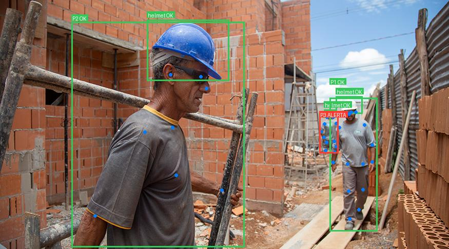
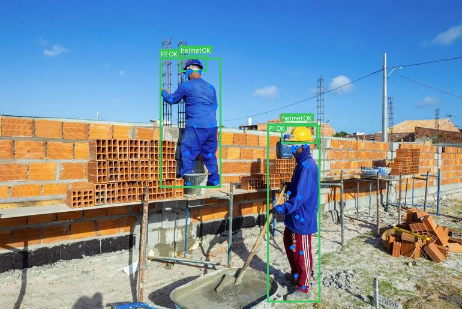
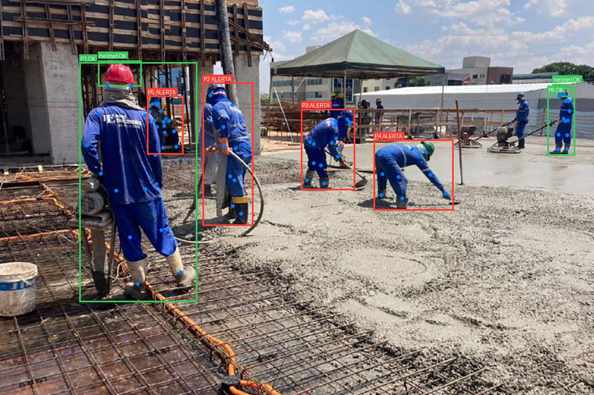
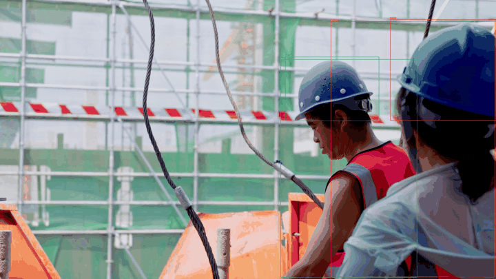

# Detecção e validação de capacetes com RF-DETR

Projeto de visão computacional para canteiros de obras. Ele treina um `RFDETRSmall`
para detectar capacetes e o combina com `RFDETRKeypointPreview` para validar o uso
do capacete por pessoa.

## Funcionamento

```text
Imagem
├── RFDETRSmall treinado ───────────────► capacetes
└── RFDETRKeypointPreview pré-treinado ─► pessoas e keypoints
                                             │
                                             ▼
                       associação + validação da região da cabeça
                                             │
                                             ▼
                       imagem anotada + relatório JSON
```

O checkpoint deste projeto possui uma única classe positiva, `helmet`. As pessoas
são obtidas exclusivamente pelo modelo pré-treinado de keypoints.

### Por que combinar um modelo treinado com keypoints pré-treinados?

O `RFDETRSmall` é treinado especificamente com as imagens e anotações de EPI do
projeto. Por isso, ele aprende a localizar capacetes no cenário real de canteiro,
com iluminação, distância, ângulos e tipos de equipamento presentes no dataset.
Por outro lado, ele não oferece contexto corporal suficiente para responder a
pergunta mais importante: **aquele capacete pertence a qual pessoa?**

O `RFDETRKeypointPreview` já vem pré-treinado para localizar pessoas e os pontos
da cabeça, como nariz, olhos e orelhas. Usá-lo evita a necessidade de anotar
keypoints manualmente no dataset de EPI e permite validar se o capacete detectado
está na região esperada da pessoa.

Essa combinação traz três vantagens principais:

- **Menos falsos positivos:** um objeto parecido com capacete, mas longe de uma
  cabeça, pode ser marcado como inválido.
- **Resultado por pessoa:** em vez de apenas contar capacetes na imagem, a
  pipeline informa quais pessoas estão protegidas ou em alerta.
- **Melhor aproveitamento do dataset:** o detector é especializado no EPI local,
  enquanto o conhecimento corporal vem de um modelo de pose já treinado em grande
  escala.

## Recursos

- Treinamento configurável por YAML.
- Receitas para treino padrão, rápido, com aumentos agressivos e learning rate menor.
- Inferência combinada de capacete e pose humana.
- Associação automática do capacete à pessoa mais próxima.
- Validação geométrica pela região da cabeça.
- Alertas minimalistas e relatório JSON por pessoa.

## Instalação

Requisitos: Python 3.10+, [uv](https://docs.astral.sh/uv/) e, preferencialmente, GPU CUDA.

```bash
git clone git@github.com:matheeusper/epi-with-keypoints.git
cd epi-with-keypoints
uv sync
```

Os comandos usam `uv run`, portanto não é preciso ativar o ambiente virtual manualmente.

## Dataset

O dataset de origem é o [Construction-PPE da Ultralytics](https://docs.ultralytics.com/datasets/detect/construction-ppe/), disponibilizado sob licença AGPL-3.0. Ele contém 1.416 imagens divididas em 1.132 de treino, 143 de validação e 141 de teste, originalmente anotadas em 11 classes de EPI.

Este projeto não treina as 11 classes. O script
[`prepare_helmet_dataset.py`](prepare_helmet_dataset.py) mantém somente as caixas
da classe original `helmet` (id `0`), descarta as demais — inclusive `Person` e
`no_helmet` — e produz um dataset de uma única classe, também id `0`.

O resultado é normalizado para o layout YOLO aceito pelo RF-DETR:

```text
construction-ppe-helmet/
├── data.yaml
├── train/
│   ├── images/
│   └── labels/
├── valid/
│   ├── images/
│   └── labels/
└── test/
    ├── images/
    └── labels/
```

Baixe e descompacte o dataset oficial como `construction-ppe/` na raiz do projeto.
Em seguida, gere a versão de capacete:

```bash
uv run python prepare_helmet_dataset.py
```

Por padrão, as imagens do dataset derivado são links simbólicos para evitar
duplicação. Para uma cópia independente, use `--copy-images`. O preparador aceita
tanto o layout oficial `images/<split>` quanto o layout local `<split>/images`.

## Treinamento

O [train.py](train.py) carrega a receita, fixa a seed, instancia `RFDETRSmall` e inicia o treinamento.

```bash
uv run python train.py --config configs/config_helmet_only_576.yaml
```

| Receita | Uso |
| --- | --- |
| `configs/config_base.yaml` | Receita legada para o dataset multiclasse. |
| `configs/config_fast_train.yaml` | Teste rápido para o dataset multiclasse. |
| `configs/config_high_aug.yaml` | Aumentos fortes para o dataset multiclasse. |
| `configs/config_low_lr.yaml` | Ajuste fino multiclasse com learning rate menor. |
| `configs/config_helmet_smoke_576.yaml` | Teste de VRAM e pipeline em 576 px. |
| `configs/config_helmet_only_576.yaml` | Receita recomendada: treino final somente de capacete. |

As receitas contêm `general`, `training`, `early_stopping` e `augmentations`. Ajuste `dataset_dir`, `device`, `epochs`, `batch_size` e `lr` conforme seu ambiente.
Elas usam `device: cuda`; sem GPU CUDA, altere esse campo para `cpu` (o treino será
consideravelmente mais lento).

O treino recomendado grava o melhor modelo em
`output_helmet_only_576/checkpoint_best_total.pth`. Pesos não são versionados no
repositório: informe esse caminho com `--ppe-checkpoint` ou copie o arquivo para
`models/helmet_only_576_best.pth`, que é o caminho padrão da inferência.

## Métricas do treinamento

O checkpoint avaliado (`models/helmet_only_576_best.pth`) foi treinado para a única
classe `helmet`, em resolução de 576 px. Os rótulos do conjunto derivado
registram 1.132 exemplos de treino, 143 de validação e 141 de teste; respectivamente,
1.341, 201 e 192 anotações de capacete.

| Indicador do checkpoint | Valor |
| --- | --- |
| Épocas concluídas no checkpoint | 11 |
| Passos globais | 781 |

### Avaliação no conjunto de teste

O checkpoint foi avaliado em 141 imagens e 192 capacetes anotados do split `test`.
As métricas abaixo usam a avaliação COCO de caixas; precisão, recall e F1 usam
IoU de 0,50 no melhor limiar de confiança.

| Métrica | Resultado |
| --- | ---: |
| mAP@[0.50:0.95] | 55,53% |
| mAP@0.50 | 95,00% |
| mAP@0.75 | 58,66% |
| mAR@100 | 66,30% |
| Precisão@0.50 | 93,75% |
| Recall@0.50 | 93,75% |
| F1@0.50 | 93,75% |
| Confiança no melhor F1 | 0,435 |

Para reproduzir a avaliação, execute:

```bash
uv run python evaluate_helmet.py \
  --checkpoint output_helmet_only_576/checkpoint_best_total.pth
```

O relatório completo é salvo em `outputs/evaluation/helmet_test_metrics.json`.
O avaliador usa `construction-ppe-helmet/test`, já preparado com imagens e rótulos
da única classe `helmet`.

## Inferência e validação de capacete

O [infer_ppe_keypoints.py](infer_ppe_keypoints.py) carrega o checkpoint treinado, o modelo de keypoints e a imagem. Na primeira execução, os pesos de keypoints podem ser baixados automaticamente.

```bash
uv run python infer_ppe_keypoints.py \
  --image images/image2.jpg \
  --ppe-checkpoint output_helmet_only_576/checkpoint_best_total.pth
```

Também é possível processar um vídeo completo. Os modelos são carregados uma única
vez e aplicados a cada quadro; a saída preserva a taxa de quadros do arquivo de
entrada.

```bash
uv run python infer_ppe_keypoints.py --video videos/obra.mp4
```

O comando acima cria `outputs/obra/annotated/obra_ppe_keypoints.mp4` e
`outputs/obra/reports/obra_ppe_keypoints.json`. O JSON inclui o resultado de cada
quadro e o respectivo instante em segundos. Para escolher os destinos e testar
apenas parte do vídeo:

```bash
uv run python infer_ppe_keypoints.py \
  --video videos/obra.mp4 \
  --output resultados/obra_anotada.mp4 \
  --report resultados/obra_relatorio.json \
  --max-frames 100
```

Se o codec padrão `mp4v` não estiver disponível, informe um codec aceito pelo
sistema, por exemplo `--codec avc1`.

Os limiares padrão foram calibrados como ponto de partida para esse modelo:
`0.35` para capacetes, `0.55` para pessoas, `0.30` para keypoints e `0.75` para
supressão de pessoas duplicadas. Ajuste-os com vídeos reais do ambiente quando
for necessário priorizar mais detecções ou menos falsos alertas.

Por padrão, cada inferência é organizada em uma pasta própria dentro de `outputs/`:

```text
outputs/
└── image/
    ├── annotated/
    │   └── image_ppe_keypoints.jpg   # imagem ou vídeo anotado
    └── reports/
        └── image_ppe_keypoints.json  # relatório de conformidade
```

### Anotações

- `P1 OK` verde: pessoa com capacete validado na região da cabeça.
- `P1 ALERTA` vermelho: pessoa sem capacete validado.
- `helmet OK` verde: capacete em posição compatível.
- `helmet X` vermelho: capacete fora da região esperada ou sem associação.

Os keypoints são usados internamente e ficam ocultos por padrão para manter a imagem limpa.

### Resultados das inferências em imagem

As saídas abaixo foram geradas pela pipeline com as cinco imagens de exemplo.

| Image 1 | Image 2 |
| --- | --- |
|  |  |

| Image 3 | Image 4 |
| --- | --- |
|  |  |

| Image 5 |
| --- |
|  |

### Melhores momentos dos testes em vídeo

Os exemplos foram selecionados entre cinco inferências em vídeo, priorizando
quadros com detecções consistentes e capacetes claramente visíveis. Caixas verdes
indicam capacete validado; caixas vermelhas representam alerta.

**Plano aberto — quadro 304 (12,67 s).** Quatro pessoas detectadas e três
capacetes validados. É o melhor exemplo para avaliar a associação em um cenário
com várias pessoas.


**Plano próximo — quadro 400 (8,00 s).** Duas pessoas e dois capacetes
validados; é o exemplo mais claro para inspeção visual da região da cabeça.



### Opções

```bash
uv run python infer_ppe_keypoints.py \
  --image images/image2.jpg \
  --ppe-checkpoint output_helmet_only_576/checkpoint_best_total.pth \
  --output resultados/imagem_anotada.jpg \
  --report resultados/relatorio.json \
  --ppe-threshold 0.35 \
  --keypoint-threshold 0.55
```

| Opção | Descrição |
| --- | --- |
| `--image` | Imagem de entrada; obrigatória quando `--video` não for usado. |
| `--video` | Vídeo de entrada; mutuamente exclusivo com `--image`. |
| `--ppe-checkpoint` | Checkpoint do detector de EPIs. |
| `--output` | Caminho da imagem ou vídeo anotado. |
| `--report` | Caminho do relatório JSON. |
| `--ppe-threshold` | Limiar de capacete; padrão `0.35`. |
| `--keypoint-threshold` | Limiar de pessoas; padrão `0.55`. |
| `--keypoint-confidence` | Confiança mínima de keypoint; padrão `0.30`. |
| `--person-nms-iou` | IoU máximo antes de suprimir pessoas duplicadas; padrão `0.75`. |
| `--draw-keypoints` | Exibe keypoints para depuração. |
| `--hide-person-boxes` | Oculta as caixas de pessoas. |
| `--codec` | Codec de quatro caracteres para saída de vídeo; padrão `mp4v`. |
| `--max-frames` | Limita a quantidade de quadros processados (teste). |

## Relatório JSON

O relatório registra a validação por pessoa:

```json
{
  "pessoas": [
    {
      "id": 1,
      "epis_validados": 1,
      "epis": { "capacete": { "status": "validado" } }
    }
  ]
}
```

Estados possíveis: `validado`, `fora_da_regiao`, `nao_verificavel` e `ausente`.

## Estrutura

```text
.
├── configs/                         # receitas YAML de treinamento
│   ├── config_helmet_smoke_576.yaml # teste de VRAM em 576 px
│   └── config_helmet_only_576.yaml  # treino final focado em capacete
├── images/                          # imagens de entrada e exemplos anotados
├── docs/examples/                    # resultados de imagem e momentos de vídeo
├── models/                          # pesos locais de inferência (ignorado pelo Git)
│   └── helmet_only_576_best.pth
├── construction-ppe/                # dataset original, ignorado pelo Git
├── construction-ppe-helmet/         # dataset derivado de uma classe, ignorado pelo Git
├── infer_ppe_keypoints.py           # inferência e validação de capacete
├── evaluate_helmet.py                # avaliação COCO do checkpoint no split de teste
├── prepare_helmet_dataset.py         # filtragem e normalização YOLO para helmet
├── train.py                         # treinamento do RFDETRSmall
├── pyproject.toml                   # dependências e metadados do projeto
└── uv.lock                          # versões bloqueadas das dependências
```

Os arquivos `*_ppe_keypoints.json` e imagens anotadas gerados durante a inferência
são artefatos locais; escolha explicitamente quais exemplos deseja versionar.

## Limitações

- A regra atual avalia exclusivamente capacete.
- Pessoas pequenas, oclusas ou com keypoints imprecisos podem gerar resultado inconclusivo.
- Calibre os limiares com imagens reais do ambiente de operação.
- Resultados devem ser revisados antes de decisões críticas de segurança.
